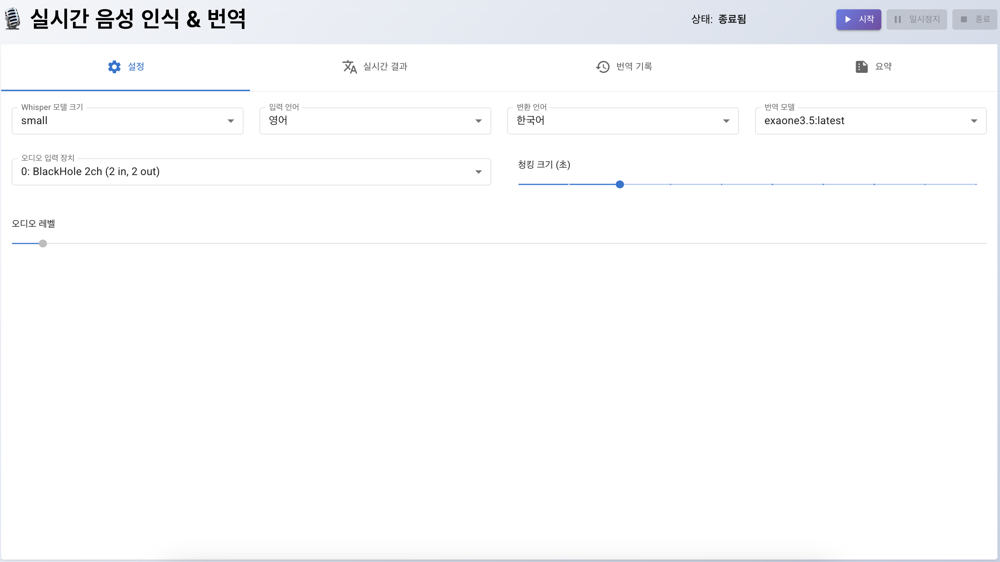
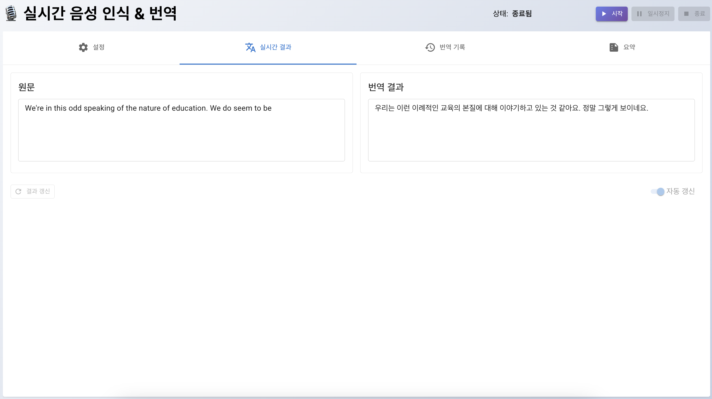
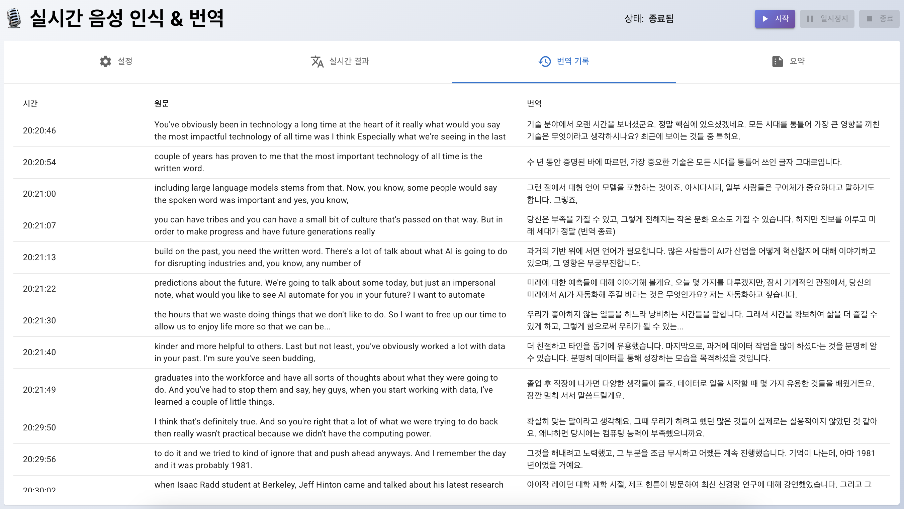
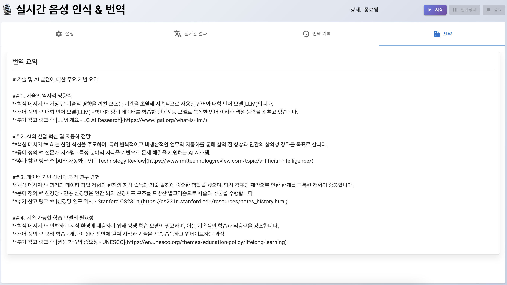

# STT_WITH_LAPTOP 프로젝트

실시간 음성 인식(STT) 및 번역 시스템으로, 로컬 PC에서 Whisper 모델과 Ollama를 활용하여 시스템 오디오를 다양한 언어로 실시간 변환 및 번역을 제공합니다.

## 프로젝트 소개

이 프로젝트는 실시간 음성 인식과 번역을 결합한 강력한 도구로, 사용자가 음성으로 입력한 내용을 즉시 텍스트로 변환하고 다양한 언어로 번역할 수 있습니다. 아래 스크린샷을 통해 주요 기능을 살펴보겠습니다.

### 주요 기능 시연

#### 1. 직관적인 설정 인터페이스


- Whisper 모델 크기 선택 (tiny부터 large까지)
- 입력/출력 언어 선택 (한국어, 영어, 일본어, 중국어 지원)
- 오디오 입력 장치 선택
- 청킹 크기 조정
- 번역 모델 선택

#### 2. 실시간 번역 결과


- 실시간 음성 인식 결과 표시
- 즉시 번역된 텍스트 확인
- 오디오 레벨 모니터링
- 자동/수동 갱신 옵션

#### 3. 번역 기록 관리


- 시간순 번역 기록 저장
- 원문과 번역문 비교
- 스크롤 가능한 기록 테이블
- 실시간 업데이트

#### 4. 지능형 요약 기능


- LangGraph 기반 컨텍스트 인식 요약
- 4가지 전문 템플릿 지원
- 마크다운 형식의 구조화된 출력
- 자동 템플릿 선택

## 프로젝트 목적

이 프로젝트는 다음과 같은 목적으로 개발되었습니다:

1. **실시간 음성 인식**: 시스템 오디오(마이크 또는 시스템 사운드)를 실시간으로 캡처하여 텍스트로 변환
2. **다국어 번역**: 인식된 텍스트를 다양한 언어(한국어, 영어, 일본어, 중국어 등)로 번역
3. **사용자 친화적 인터페이스**: 쉽게 사용할 수 있는 모던한 웹 인터페이스 제공
4. **로컬 처리**: 모든 처리가 사용자의 PC에서 이루어져 프라이버시 보장 및 인터넷 연결 없이 사용 가능
5. **지능형 요약**: LangGraph 기반 에이전트 시스템을 활용한 컨텍스트 인식 요약 기능

## 프로젝트 구성

이 프로젝트는 React 프론트엔드와 Flask 백엔드로 구성된 웹 애플리케이션입니다.

### 디렉토리 구조

```
STT_with_laptop/
└── react-stt-app/          # 메인 애플리케이션 폴더
    ├── backend/            # Flask 백엔드
    │   ├── app.py          # 메인 API 서버
    │   └── requirements.txt# 필요 Python 패키지
    └── frontend/           # React 프론트엔드
        ├── public/         # 정적 파일
        ├── src/            # React 소스코드
        │   ├── App.js      # 메인 애플리케이션 컴포넌트
        │   └── App.css     # 스타일시트
        └── package.json    # 의존성 정보
```

### 주요 기술 스택

- **백엔드**:
  - Python 3.8+
  - Flask (웹 서버)
  - Whisper (OpenAI 음성 인식 모델)
  - SoundDevice (오디오 캡처)
  - Numpy (오디오 데이터 처리)
  - Pandas (번역 결과 저장)
  - LangGraph (에이전트 워크플로우 관리)
  - LangChain (LLM 통합)

- **프론트엔드**:
  - React 18
  - Material-UI (UI 컴포넌트)
  - Axios (HTTP 요청)

- **외부 의존성**:
  - Ollama (로컬 LLM 모델 서비스)
  - DeepSeek (템플릿 선택 에이전트)
  - ExaOne (요약 생성 에이전트)

## 설치 및 실행 방법

### 공통 필수 요구사항

- Python 3.8 이상
- Node.js 14 이상
- [Ollama](https://ollama.ai) 설치 및 실행
- 인터페이스 실행을 위한 웹 브라우저

### macOS 설정

1. **Python 및 필수 패키지 설치**:
   ```bash
   # Homebrew를 통한 Python 설치 (이미 있다면 생략)
   brew install python@3.10
   
   # 백엔드 의존성 설치
   cd react-stt-app/backend
   pip install -r requirements.txt
   ```

2. **오디오 설정**:
   - 시스템 오디오를 캡처하려면 BlackHole과 같은 가상 오디오 드라이버 설치 권장:
   ```bash
   brew install blackhole-2ch
   ```
   - 시스템 환경설정 > 사운드 > 출력에서 "BlackHole 2ch"와 실제 스피커를 멀티 출력 장치로 설정
   - 시스템 환경설정 > 사운드 > 입력에서 "BlackHole 2ch" 선택

3. **Node.js 및 npm 패키지 설치**:
   ```bash
   # Homebrew를 통한 Node.js 설치 (이미 있다면 생략)
   brew install node
   
   # 프론트엔드 의존성 설치
   cd react-stt-app/frontend
   npm install
   ```

4. **Ollama 설치 및 실행**:
   ```bash
   # Ollama 설치
   curl -fsSL https://ollama.ai/install.sh | sh
   
   # Ollama 실행
   ollama serve
   
   # 필요한 모델 다운로드 (별도 터미널에서)
   ollama pull exaone3.5:latest
   ```

### Windows 설정

1. **Python 설치**:
   - [Python 공식 웹사이트](https://www.python.org/downloads/)에서 Python 3.8 이상 설치
   - 설치 시 "Add Python to PATH" 옵션 선택

2. **필수 Python 패키지 설치**:
   ```cmd
   cd react-stt-app\backend
   pip install -r requirements.txt
   ```

3. **오디오 설정**:
   - 시스템 오디오 캡처를 위해 [VB-Audio Virtual Cable](https://vb-audio.com/Cable/) 설치
   - 오디오 설정에서 재생 장치로 "CABLE Input" 선택

4. **Node.js 및 npm 패키지 설치**:
   - [Node.js 공식 웹사이트](https://nodejs.org/)에서 Node.js 14 이상 설치
   ```cmd
   cd react-stt-app\frontend
   npm install
   ```

5. **Ollama 설치 및 실행**:
   - [Ollama GitHub 페이지](https://github.com/ollama/ollama)에서 Windows 설치 패키지 다운로드
   - 설치 후 Ollama 실행
   - 필요한 모델 다운로드:
   ```cmd
   ollama pull exaone3.5:latest
   ```

### 애플리케이션 실행

1. **백엔드 서버 실행**:
   ```bash
   # macOS / Linux
   cd react-stt-app/backend
   python app.py
   
   # Windows
   cd react-stt-app\backend
   python app.py
   ```

2. **프론트엔드 서버 실행**:
   ```bash
   # macOS / Linux
   cd react-stt-app/frontend
   npm start
   
   # Windows
   cd react-stt-app\frontend
   npm start
   ```

3. 웹 브라우저에서 http://localhost:3000 접속

## 사용 방법

1. **설정**:
   - Whisper 모델 크기 선택 (tiny, base, small, medium, large)
   - 입력 언어 및 변환 언어 선택
   - 오디오 입력 장치 선택
   - 청킹 크기 설정 (초 단위)
   - 번역 모델 선택

2. **실행 및 제어**:
   - "시작" 버튼 클릭하여 음성 인식 및 번역 시작
   - "일시정지" 버튼으로 처리 일시 중지
   - "종료" 버튼으로 처리 중단 및 요약 생성

3. **결과 확인**:
   - 실시간 음성 인식 결과 및 번역문 확인
   - 번역 기록 테이블로 이전 결과 확인
   - 처리 종료 시 전체 대화 요약 확인

4. **설정 최적화**:
   - 음성 품질과 성능 간 균형을 위해 청킹 크기 조정
   - 하드웨어 사양에 맞는 Whisper 모델 크기 선택
   - 자동 갱신 토글로 실시간 업데이트 제어

## 지능형 요약 시스템

이 프로젝트는 번역된 콘텐츠를 지능적으로 요약하기 위해 LangGraph 기반의 에이전트 시스템을 활용합니다.

### 요약 워크플로우

1. **컨텍스트 인식 템플릿 선택**:
   - DeepSeek-r1:7b 모델이 번역된 콘텐츠를 분석하여 최적의 템플릿 선택
   - 번역 내용의 주제, 구조, 목적에 따라 4가지 템플릿 중 선택
   - 각 사용 사례에 맞는 템플릿 자동 매칭 기능

2. **템플릿 기반 요약 생성**:
   - 선택된 템플릿을 기반으로 ExaOne3.5 모델이 구조화된 요약 생성
   - 일관된 형식과 높은 품질의 요약 제공
   - 최종 요약은 UI의 요약 섹션에 표시

### 요약 템플릿 유형

프로젝트는 다음과 같은 사전 정의된 요약 템플릿을 제공합니다:

1. **소프트웨어 아키텍처 템플릿**:
   - 주요 개념을 4개의 소제목으로 구분
   - 각 소제목마다 핵심 메시지 요약
   - 용어 정의 및 참고 링크 제공
   - Markdown 형식으로 출력

2. **기술 브리핑 템플릿**:
   - 주요 모듈/컴포넌트 식별 및 정의
   - 각 모듈의 동작 원리 설명
   - 운영 시 고려할 주의사항 제시
   - 다음 단계 권장 사항 제공

3. **FAQ 템플릿**:
   - 자주 묻는 질문 형태로 정보 구성
   - 질문별 간결한 답변 제공
   - 심화 학습 리소스 추천

4. **비교 분석 템플릿**:
   - 주요 기술/프레임워크 비교 표 생성
   - 항목별 특징 분석
   - 사용 시 유의점 및 성능 차이 표시

이 지능형 요약 시스템은 "종료" 버튼을 클릭할 때 자동으로 작동하며, 사용자에게 번역된 콘텐츠의 핵심을 가장 적합한 형식으로 제공합니다.

## 문제 해결

- **오디오 입력이 감지되지 않는 경우**:
  - 올바른 오디오 입력 장치가 선택되었는지 확인
  - 시스템 볼륨이 충분히 높은지 확인
  - 가상 오디오 드라이버 설정 확인

- **번역 모델이 로드되지 않는 경우**:
  - Ollama 서버가 실행 중인지 확인 (http://localhost:11434 접속)
  - 필요한 모델이 다운로드되었는지 확인
  - 방화벽이 Ollama 서버 접근을 차단하지 않는지 확인

- **JSON 직렬화 오류가 발생하는 경우**:
  - 백엔드 서버 재시작
  - NumPy 타입을 기본 Python 타입으로 변환하는지 확인

## 라이센스

이 프로젝트는 MIT 라이센스 하에 배포됩니다.

## 기여

버그 리포트, 기능 요청, 풀 리퀘스트를 환영합니다. 

## 프로젝트 개발 동기: 영어의 바다에서 살아남기

안녕하세요, 이 프로젝트의 창시자입니다! 

여러분은 영어로 진행되는 미팅에서 "Let me know your thoughts"라는 말을 듣고 "네 알겠습니다"라고 고개를 끄덕인 후, 실제로는 어떤 생각도 떠오르지 않는 공포를 경험해보셨나요? 🙃

저는 영어로 진행되는 미팅, 세션, 교육을 피해 다니는 회사 생활의 달인이었습니다. 그러나 운명의 장난인지 제 업무에는 영어로 진행되는 일들이 끊임없이 찾아왔고, 매번 "미팅 녹화본 공유해주세요"를 연발하는 슬픈 직장인이 되었죠.

어느 날, 중요한 화상 미팅 중에 "What's your opinion on this matter?"라는 질문을 받고 멍하니 웃기만 하다가 "Sorry, could you repeat that?"이라는 만능 문장을 세 번째 사용하게 된 순간, 깨달았습니다.

"아, 이대로는 안 되겠다."

그래서 탄생한 것이 바로 이 프로젝트입니다! 저처럼 영어의 바다에서 허우적대는 직장인들, "영알못(영어 알아듣지 못하는)" 전우들에게 작은 구명조끼를 만들어 드리고 싶었습니다. 

이 프로젝트는 여러분의 PC에서 흘러나오는 모든 오디오(Zoom 미팅, Teams 콜, YouTube 강의 등)를 실시간으로 인식하고 번역해 줍니다. 더 이상 "I'll get back to you on that"이라는 도망용 문장은 필요 없을 겁니다. 이제 당당하게 대화에 참여하세요!

회의 중에 노트북이 갑자기 한국어로 중얼거리기 시작한다면, 그건 제 프로젝트가 여러분을 구하러 온 것입니다. 당황하지 마시고, 은근슬쩍 화면을 확인하세요. 😎

영어의 파도에 휩쓸리지 않고, 함께 헤엄쳐 나가요! 